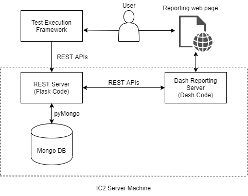

# Entities

1.  **Test Execution Framework:** Cortx test automation framework used for executing all automated QA tests.

2.  **User:** Any person who is using test execution framework or reporting web page.

3.  **Reporting web page:** Web page for showing QA execution reports. It will fetch data from MongoDB to show data on webpage.

4.  **REST Server:** It is flask-based rest server. It will provide REST apis for all database operations.

5.  **Dash Reporting Server:** Dash is a productive Python framework for building web analytic applications. Written on top of Flask.

6.  **Mongo DB:** MongoDB is an open-source document database and leading NoSQL database. It will be used for storing all test execution data.

7.  **REST APIs:** A RESTful API is an architectural style for an application program interface (API) that uses HTTP requests to access and use data. That data can be used to GET, PUT, POST and DELETE data types, which refers to the reading, updating, creating and deleting of operations concerning resources. Here, REST APIs will be used for all DB related operations.

8.  **PyMongo:** PyMongo is a Python distribution containing tools for working with MongoDB and is the recommended way to work with MongoDB from Python. REST APIs internally will use pymango for accessing mango DB.

9.  **IC2 Server Machine:** IC2 (cftic2.pun.seagate.com) is physical server machine in pune lab. MongoDB is hosted on this machine.

# Flow

1.  User will start test execution using test execution framework.

2.  Test execution framework will run tests on LR cluster. After test execution, it will collect some test specific data.

3.  Test execution framework will store test specific data in mongo DB using REST API provided by REST server.

4.  User will access reporting web page to get test execution reports. Based on user inputs on web page, web page back end code (dash reporting server code) will fetch data from mongo DB using REST APIs.

5.  Fetched data will be post processed and showed to user on web page.

# Database Schema

Mongo DB Collection for storing test execution details.

| **Field Name**                                | **Mandatory** | **Index** |
|-----------------------------------------------|---------------|-----------|
| **Setup details:**                            |               |           |
| Client Machine hostname                       | Y             |           |
| Number of nodes                               | Y             |           |
| OS (Centos version for Node)                  | Y             |           |
| Node hostname (For each node)                 | Y             |           |
| **Test details:**                             |               |           |
| Test Name                                     | Y             |           |
| Test id                                       | Y             |           |
| Test id labels                                | Y             |           |
| Test tag if any                               | Y             | Y         |
| Test plan id                                  | Y             | Y         |
| Test execution id                             | Y             | Y         |
| Test type: Avocado/CFT/Locust/S3bench/ Pytest | Y             |           |
| Test Component: S3, CSM, Motr etc.            | Y             |           |
| Test team: CFT / Automation / Component test  | Y             |           |
| Test Start time                               | Y             |           |
| Test Execution time                           | Y             |           |
| Build type: Release/beta                      | Y             |           |
| Build No                                      | Y             | Y         |
| Log path                                      | Y             |           |
| Test result                                   | Y             | Y         |
| Health Check Post Test: Pass/Fail             | Y             |           |
| Automated/Manual                              | Y             |           |
| **In case of failure:**                       |               |           |
| Issue Type: Dev/Test issue                    |               |           |
| Issue id: bug id                              |               |           |
| Is regression: Known issue                    |               |           |
| Log collection done: true/false               |               |           |
| **Timing Details:**                           |               |           |
| Node Reboot Time                              |               |           |
| All Service Start Time                        |               |           |
| All Service Stop Time                         |               |           |
| Bucket Deletion Time                          |               |           |
| Bucket Creation Time                          |               |           |
| Boxing Time                                   |               |           |
| Unboxing Time                                 |               |           |
| Update Time                                   |               |           |
| Deployment Time                               |               |           |

# REST server APIs guide
### While consuming any API:
1. Include `Content-Type: application/json` in request headers
2. Include `db_username` and `db_password` in json body for authentication 
## Endpoints
### 1. create
* Can be used to create new execution entries in database
* Data types for database fields

    |**Mandatory**|    **Field Name**   |   **Data Type**    |
    | ----------- | ------------------- | ------------------ |
    | Yes         | clientHostname      | String             |
    | Yes         | noOfNodes           | Integer            |
    | Yes         | OSVersion           | String             |
    | Yes         | nodesHostname       | List of String     |
    | Yes         | testName            | String             |
    | Yes         | testID              | String             |
    | Yes         | testIDLabels        | List of String     |
    | Yes         | testTags            | List of String     |
    | Yes         | testPlanID          | String             |
    | Yes         | testExecutionID     | String             |
    | Yes         | testType            | String             |
    | Yes         | testExecutionLabel  | String             |
    | Yes         | testTeam            | String             |
    | Yes         | testStartTime       | String in ISO 8601 |
    | Yes         | testExecutionTime   | Integer            |
    | Yes         | buildType           | String             |
    | Yes         | buildNo             | String             |
    | Yes         | logPath             | String             |
    | Yes         | testResult          | String             |
    | Yes         | healthCheckResult   | String             |
    | Yes         | executionType       | String             |
    | Yes         | testPlanLabel       | String             |
    | Yes         | latest              | Boolean            |
    | Yes         | feature             | String             |
    | No          | issueType           | String             |
    | No          | issueID             | String             |
    | No          | isRegression        | Boolean            |
    | No          | logCollectionDone   | Boolean            |

#### Examples:
1. Command line
```
curl -L -X POST 'http://127.0.0.1:5000/reportsdb/create' \
-H 'Content-Type: application/json' \
--data-raw '{
    "OSVersion": "CentOS",
    "buildNo": "0002",
    "buildType": "Release",
    "clientHostname": "iu10-r18.pun.seagate.com",
    "executionType": "Automated",
    "healthCheckResult": "Fail",
    "isRegression": False,
    "issueID": "EOS-000",
    "issueType": "Dev",
    "logCollectionDone": True,
    "logPath": "DemoPath",
    "noOfNodes": 2,
    "nodesHostname": [
        "sm7-r18.pun.seagate.com",
        "sm8-r18.pun.seagate.com"
    ],
    "testExecutionLabel": "S3",
    "testExecutionID": "TEST-0000",
    "testExecutionTime": 0,
    "testID": "TEST-0000",
    "testIDLabels": [
        "Demo",
        "Labels"
    ],
    "testPlanLabel": "Regular",
    "testName": "Demo test",
    "testPlanID": "TEST-0000",
    "testResult": "Pass",
    "testStartTime": "2020-12-29T09:01:38+00:00",
    "testTags": [
        "Demo",
        "Tags"
    ],
    "testTeam": "CFT",
    "testType": "Pytest",
    "latest": true,
    "feature": "Data Recovery",
    "db_username": "db_username",
    "db_password": "db_password"
}'
```
2. python - requests
```
import requests
import json
endpoint = "reportsdb/create"
host = "http://127.0.0.1:5000/"

payload = {
    "OSVersion": "Redhat",
    "buildNo": "0000",
    "buildType": "Release",
    "clientHostname": "iu10-r18.pun.seagate.com",
    "executionType": "Automated",
    "healthCheckResult": "Fail",
    "isRegression": False,
    "issueID": "EOS-000",
    "issueType": "Dev",
    "logCollectionDone": True,
    "logPath": "DemoPath",
    "noOfNodes": 2,
    "nodesHostname": [
        "sm7-r18.pun.seagate.com",
        "sm8-r18.pun.seagate.com"
    ],
    "testPlanLabel": "Regular",
    "testExecutionLabel": "S3",
    "testExecutionID": "TEST-0000",
    "testExecutionTime": 0,
    "testID": "TEST-1111",
    "testIDLabels": [
        "Demo",
        "Labels"
    ],
    "testName": "Demo test",
    "testPlanID": "TEST-0000",
    "testResult": "Pass",
    "testStartTime": "2020-12-29T09:01:38+00:00",
    "testTags": [
        "Demo",
        "Tags"
    ],
    "testTeam": "CFT",
    "testType": "Pytest",
    "latest": true,
    "feature": "Data Recovery",
    "db_username": "db_username",
    "db_password": "db_password"
}
headers = {
  'Content-Type': 'application/json'
}

response = requests.request("POST", host+endpoint,
                            headers=headers, data=json.dumps(payload))

print(response.text)
```

#### HTTP Status Code:
|Code | Description |
|-----|-------|
|200 | Success |
|400 | Bad Request: Missing parameters. Do not retry. |
|401 | Unauthorized: Wrong db_username/db_password. |
|403 | Forbidden: User does not have permission for operation. |
|503 | Service Unavailable: Unable to connect to mongoDB. |

### 2. search
* Can be used to search previous execution entries in database
* Can pass the exact query which can be executed using 
[db.collection.find](https://docs.mongodb.com/manual/reference/method/db.collection.find/#db.collection.find).
This allows to execute complex queries using operators.
* Fields for search 
  * query - to be searched in DB,
  * projection - return only specified fields in result documents

#### Examples:
1. Command line
```
curl -L -X GET 'http://127.0.0.1:5000/reportsdb/search' \
-H 'Content-Type: application/json' \
--data-raw '{
    "query": {"testExecutionLabel": { "$in": ["S3", "Motr"]},
              "healthCheckResult": "Fail" },
    "projection": {"OSVersion": True, "buildNo": True},
    "db_username": "db_username",
    "db_password": "db_password"
}'
```
2. python - requests
```
import requests
import json
endpoint = "reportsdb/search"
host = "http://127.0.0.1:5000/"

payload = {
    "query": {"testExecutionLabel": { "$in": ["S3", "Motr"]},
              "healthCheckResult": "Fail" },
    "projection": {"OSVersion": True, "buildNo": True},
    "db_username": "db_username",
    "db_password": "db_password"
}
headers = {
  'Content-Type': 'application/json'
}

response = requests.request("GET", host+endpoint,
                            headers=headers, data=json.dumps(payload))

print(response.text)
```

#### HTTP Status Code:
|Code | Description |
|-----|-------|
|200 | Success |
|400 | Bad Request: Missing parameters. Do not retry. |
|401 | Unauthorized: Wrong db_username/db_password. |
|403 | Forbidden: User does not have permission for operation. |
|404 | Not Found: No entry for that query in MongoDB. |
|503 | Service Unavailable: Unable to connect to mongoDB. |

### 3. update
* Can be used to update previous execution entries in database
* Include `filter` and `update` as dictionary in json body
  (More examples can be seen at [db-collection-updatemany](https://docs.mongodb.com/manual/reference/method/db.collection.updateMany/#db-collection-updatemany))

#### Examples:
1. Command line
```
curl -L -X PATCH 'http://127.0.0.1:5000/reportsdb/update' \
-H 'Content-Type: application/json' \
--data-raw '{
    "filter": {"buildType": "Beta"},
    "update": {"$set": {"buildType": "Release", "OSVersion": "Redhat"}},
    "db_username": "db_username",
    "db_password": "db_password"
}'
```
2. python - requests
```
import requests
import json
endpoint = "reportsdb/update"
host = "http://127.0.0.1:5000/"

payload = {
    "filter": {"buildType": "Beta"},
    "update": {"$set": {"buildType": "Release", "OSVersion": "Redhat"}},
    "db_username": "db_username",
    "db_password": "db_password"
}
headers = {
  'Content-Type': 'application/json'
}

response = requests.request("PATCH", host+endpoint,
                            headers=headers, data=json.dumps(payload))

print(response.text)
```

#### HTTP Status Code:
|Code | Description |
|-----|-------|
|200 | Success |
|400 | Bad Request: Missing parameters. Do not retry. |
|401 | Unauthorized: Wrong db_username/db_password. |
|403 | Forbidden: User does not have permission for operation. |
|503 | Service Unavailable: Unable to connect to mongoDB. |

# Reporting Webpage

**URL (LR R1: http://cftic2.pun.seagate.com:5002/)**

User will use reporting webpage to generate build wise reports.

**Features:**

+ Generate build wise reports

+ Provide interface to read data from mongo DB

+ Generate PDF/Word format report file
