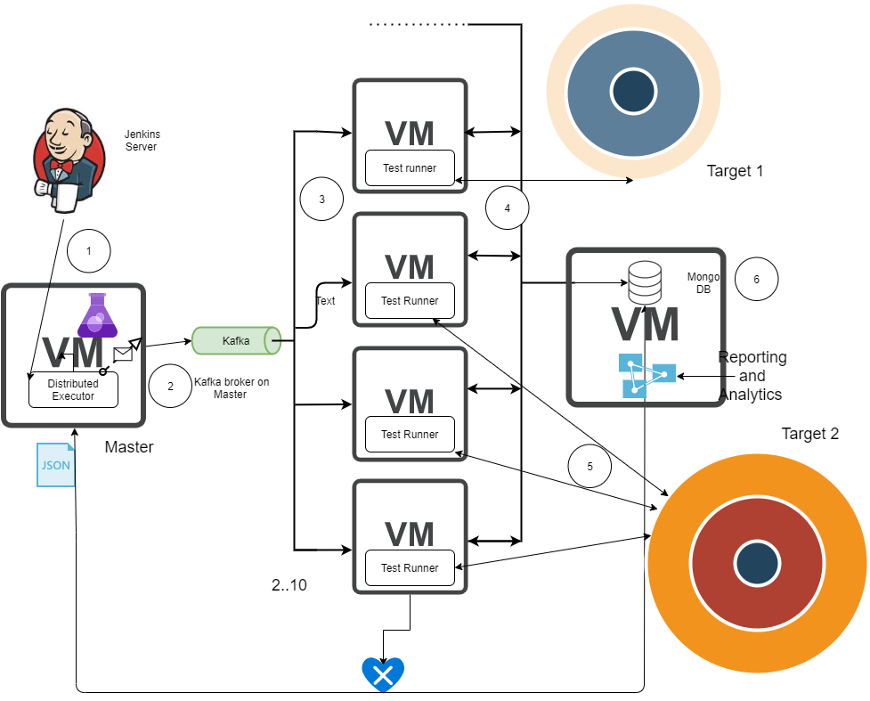
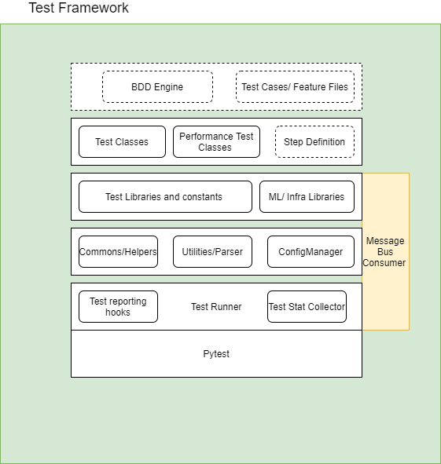
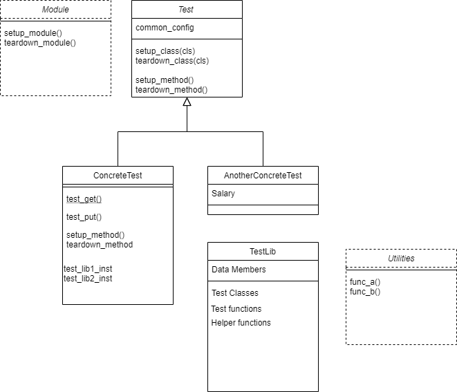

# Proposed test framework architecture
The deployment view [Test Execution Deployment](Test-Execution-Deployment-View.md) discusses about the deployment structure however same diagram can be used to explain high level design of framework
## 

The execution framework (a loosely coupled sub component of framework) will be triggered with from Jenkins with top level test runner. This top test runner has responsibility of creating an execution plan from the input taken from Jenkins for either of these 3 sources.
* Test Execution ticket
* Tags from Jenkins (test Discovery based on tags provided in Jenkins)
* Single test file function, method provided in Jenkins Job 

### Parsing Test execution ticket
TE ticket and its sub tickets will be parsed for test cases and additional information about the test class, function or method which implements the test case. Markers (tags) againsts all such test cases will be collected and a execution map (which I will explain later in seperate topic) is created. Entry Set in this execution map is feeded to Kafka topic `cortx-test-jobs` with timestamp, test_name, filename, tag and other information as a part of message. The message format will be discussed in details in section `Kafka message format`. This messages are then consumed by Kafka consumer within framework test runner and the sub execution plan is handed over to pytest engine for test exeuction. The TE tickets would be updated by the test framework.  

### Discovery based on tags provided in Jenkins
No TE execution input is required however the corresponding execution tickets are updated with results. A log message will be posted for those tests which does not have an equivalent TE ticket. 
The Top runner uses pytest tags and it's or custom test discovery mechanism from tests folder, groups them and create an execution plan which can be consumed by other test runners. The test runners on other client will decide to execute test cases in parallel or serial manner based on @parallel, @destructive and @serial tags. The test suite dependencies can also be handled while creating execution plan.
The execution map will be data structure which will provide API to feed Kafka topic.

### Algorithm for execution map
```
def create_test_execution_map(tags, te_ticket):\n
  """ Returns an order map of tags and individual test cases """
  ordered_map = OrderedDict()
  for test in te_tickets():
      fetch test tags from framework
   
  return ordered_map  
```

# Message Bus/ Kafka as a medium to distribute tests
Multiple approaches like RPC based mechanism like XML RPC and Zero MQ were evaluated for test distribution mechanisms . Kafka provides a producer and multi consumer model which fits in our context. Alternatively RabbitMQ also satisfies our requirement. Same topic `cortx-test-jobs` can be used by consumers (test-runners) 

We will add more to this section after a short POC.

# Kafka message format
Fields that needs to be transfered in json format. The Kafka message format has message identifer and value would be json with all attributes mentioned below.

* Test Name 
* Test id 
* Test id labels 
* Test tag if any  
* Test plan id 
* Test execution id 
* Test type: Avocado/CFT/Locust/S3bench/ Pytest 
* Test Component: S3, CSM, Motr etc. 
* Test team: CFT / Automation / Component test 
* Build type: Release/beta 
* Build-No  
* Test result  
* Timestamp
* Filename:
* Tag

# Config management
This will be most used component of framework in writing test cases. The main aim is to seperate test data from test case while not loosing readability of test case and minimizing config clutter. Configs at framework, suite and test levels are loaded in different ways discussed below.
Config Loading logic would be

1. Set Globals from test runner agruments from command line. At minimum what I am thinking is to put target, # of processes, debug mode, test class/test file /test method/ function, global config file in test runner. 
* 1a. If global config is specified it will be loaded from the path.
    Else default global config will be loaded by config imports in test runner
    This config is avaliable to all test libs, tests, fixtures and modules by importing config.  e.g. `from config import common_config`  
2.  The test suite specific data can be externalized and initialized in module hooks or class hooks . e.g. setup_class, teardown_class, setup_module, teardown_module. 
    The test suite specific fixtures can be used to load data in nunit style hooks. 
    If suite config exits:
        load suite config by fixtures in nunit style hooks e.g. setup_class, teardown_class, setup_module, teardown_module. 
    else:
        load control moves to test method or next fixture
3.  Test specifc data externalization should be kept minimal and parameterize, parameterize_with_cases markers can be used to supply or generate test data. 
    Test level config over shadows some suite or common configs. 
* 3a. If test config exists:
       load test config by using fixtures and parameterize, parameterize_with_cases decorators. 
           if your test data override common config:
              over shadow the test data/parameters at the start of test by declaring local variables (hiding)
           else:
              load the test data to be used by test case


# Layout and Layering


# Test execution framework sequence diagram
TBD

# Class diagram of test management
A sample class diagram for a typical feature automation depicts aggregation or composition. It should be prefered over when possible. 
Test Class 
   |
   |
Test Library
 |      |
 |     Utilities 
 |
Helpers/Test Libs/fixtures



# How to write tests
TBD

# When to use fixtures
TBD

# Glossary:
`Test execution Framework` - Part of Test Framework which will be responsible for distributing test cases across multiple test runners.
`Test Framework` - Part of Framework which will be used to write tests and libraries.  


