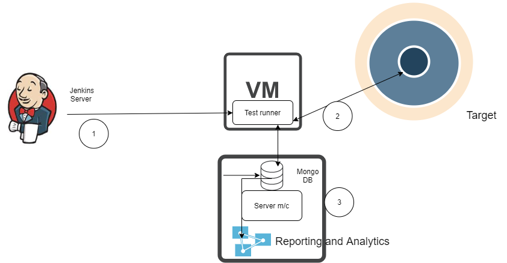

# Deployment view of full test execution setup

The sequence 1..6 is explained below in points.
1. Jenkins triggers a job which supply parameters like targets and config to top runner (distributed executor).
2. Top runner creates an execution plan which determines the sequence of execution and which tests can be run in parallel. This execution plan entries are feed to Kafka topic `cortx-test-jobs` in JSON format.  
3. Test runners are running on 1 or more virtual machines which has Kafka consumer. They belong to same consumer group and it guaranteed that a test will be executed only once  by any of the test runner. 
4. The deserialized JSON is parsed and test metadata is sent to pytest runner to run either test with a tag in parallel or test in serial order.  Test runner also decides the target (Setup) to run against from parsed JSON. 
5. Multiple test runner can point to same target. OPtimal utilization of target is decided on tags or markers attached to a test function. e.g. marker with `non-destructive` tag can run in parallel across test virtual machines. 
6. Test reporting data is saved to Mongo DB with Reporting server API at the end of pytest test run with pytest reporting hook. This data is retrived from Reporting server for further analytics and presentation. 

# Jenkins Job for full test execution setup
 `Trigger-Full-TU-Run`

# Deployment view of developer test setup/environment

# Jenkins Job for full test execution setup
`Trigger-Test-Execution`

